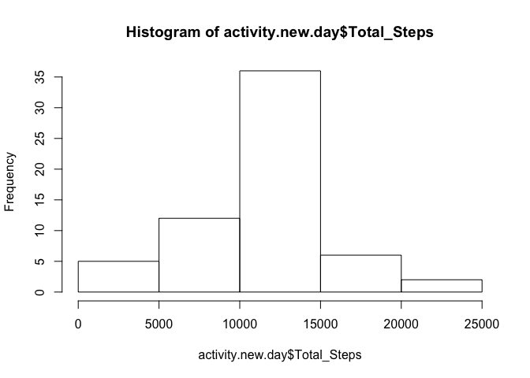

# Reproducible Research: Peer Assessment 1


## Loading and preprocessing the data
Setting directory to where the unzipped activity.zip is.

```r
setwd("/Users/lloyd/Documents/lloyd_2016/coursera/DataScience/Course5_Reproducible_Research/assignment/RepData_PeerAssessment1")
```
Read in the activity.csv file.

```r
activity <-  read.csv("activity.csv")
```
Format time by using 2012-10-01 as the start date.

```r
time <- format(seq.POSIXt(as.POSIXct(as.Date("2012-10-01")),as.POSIXct(as.Date("2012-10-01")+61),by="5 min"),"%H%M", tz="GMT")
time <- time[1:length(time)-1]
activity$time <- time
activity$datetime <- paste(activity$date,time)
```
Format day using 2012-10-01 as day number 1.

```r
library(lubridate)
activity$datetime <- ymd_hm(activity$datetime)
activity$day <- yday(activity$datetime) - 274
head(activity)
```

```
##   steps       date interval time            datetime day
## 1    NA 2012-10-01        0 0000 2012-10-01 00:00:00   1
## 2    NA 2012-10-01        5 0005 2012-10-01 00:05:00   1
## 3    NA 2012-10-01       10 0010 2012-10-01 00:10:00   1
## 4    NA 2012-10-01       15 0015 2012-10-01 00:15:00   1
## 5    NA 2012-10-01       20 0020 2012-10-01 00:20:00   1
## 6    NA 2012-10-01       25 0025 2012-10-01 00:25:00   1
```

## What is mean total number of steps taken per day?
An alternative histogram with NA removed can be done using sum(steps, na.rm = TRUE).

```r
library(dplyr)
activity <- tbl_df(activity)
activity.day <- activity %>% group_by(day) %>% summarise(Total_Steps = sum(steps))
hist(activity.day$Total_Steps)
```

<!-- -->

```r
mean(activity.day$Total_Steps,na.rm = TRUE)
```

```
## [1] 10766.19
```

```r
median(activity.day$Total_Steps,na.rm = TRUE)
```

```
## [1] 10765
```

## What is the average daily activity pattern?

```r
activity$minute <- minute(activity$datetime)
activity.minute <- activity %>% group_by(minute) %>% 
  summarise(Ave_Steps = mean(steps,na.rm = TRUE))
plot(activity.minute$minute,activity.minute$Ave_Steps,type="l")
```

<!-- -->

```r
activity.minute$minute[which.max(activity.minute$Ave_Steps)]
```

```
## [1] 15
```

## Imputing missing values
Here are all the NAs.

```r
sum(is.na(activity$steps))
```

```
## [1] 2304
```

Impute values with mean 5-minute interval and creation of new dataset.

```r
activity$impute <- rep(activity.minute$Ave_Steps,1464)

activity$newsteps <- vector(mode = "numeric",length=nrow(activity))
for (i in 1:nrow(activity)){
  if (is.na(activity$steps[i])){
    activity$newsteps[i] <- activity$impute[i]
  } else {
    activity$newsteps[i] <- as.numeric(activity$steps[i])
  }
}
head(activity)
```

```
## Source: local data frame [6 x 9]
## 
##   steps       date interval  time            datetime   day minute
##   (int)     (fctr)    (int) (chr)              (time) (dbl)  (int)
## 1    NA 2012-10-01        0  0000 2012-10-01 00:00:00     1      0
## 2    NA 2012-10-01        5  0005 2012-10-01 00:05:00     1      5
## 3    NA 2012-10-01       10  0010 2012-10-01 00:10:00     1     10
## 4    NA 2012-10-01       15  0015 2012-10-01 00:15:00     1     15
## 5    NA 2012-10-01       20  0020 2012-10-01 00:20:00     1     20
## 6    NA 2012-10-01       25  0025 2012-10-01 00:25:00     1     25
## Variables not shown: impute (dbl), newsteps (dbl)
```
Histogram, mean and median on the same dataset but with imputed values.

```r
activity.new.day <- activity %>% group_by(day) %>% summarise(Total_Steps = sum(newsteps))
hist(activity.new.day$Total_Steps)
```

<!-- -->

```r
mean(activity.new.day$Total_Steps,na.rm = TRUE)
```

```
## [1] 10766.19
```

```r
median(activity.new.day$Total_Steps,na.rm = TRUE)
```

```
## [1] 10766.19
```

## Are there differences in activity patterns between weekdays and weekends?
Here is a panel plot comparing weekday with weekend.

```r
activity$week <- weekdays(activity$datetime)

activity$weektype <- vector(mode = "character",length=nrow(activity))

for (k in 1:nrow(activity)){
  if (activity$week[k] == "Saturday" | activity$week[k] == "Sunday"){
    activity$weektype[k] <- "weekend"
  } else {
    activity$weektype[k] <- "weekday"
  }
}

activity$weektype <- as.factor(activity$weektype)

activity.minute2 <- activity %>% group_by(weektype,minute) %>% 
  summarise(No_of_Steps = mean(steps,na.rm = TRUE))

library(lattice)
xyplot(No_of_Steps ~ minute | weektype, data = activity.minute2, layout = c(1,2), type = "l")
```

<!-- -->
